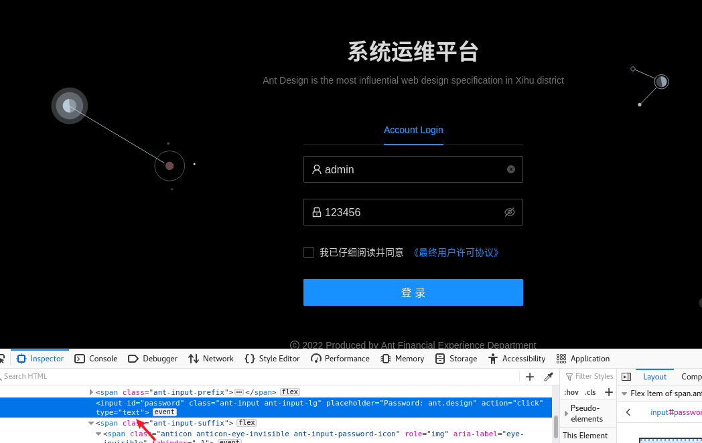
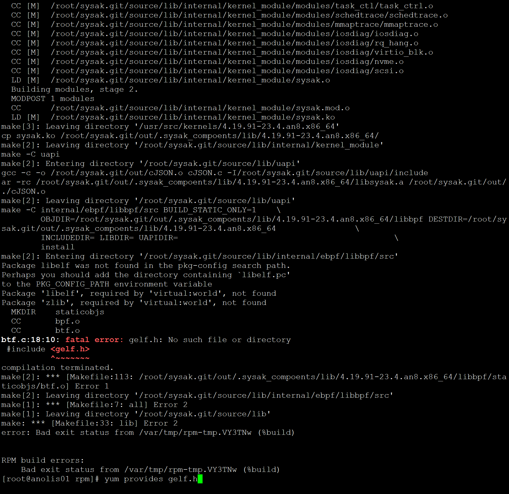

```
fork form https://gitee.com/anolis/sysom
just for fun
```


## 部署

参考: <https://mp.weixin.qq.com/s/I6ik3jFKczYbFmyLu3WmXg>


1、环境准备
操作系统：Anolis OS 8.4 ANCK 64 位
系统规格：2 核 8 g
数量：3台
网络：公网IP
2、SysOM 部署
2.1 监控组件部署
#选择 Server 节点，执行下述命令部署监控组件

```
yum install -y wget curl git tar tree htop glances
timedatectl  set-timezone CST

 ln -s /usr/share/zoneinfo/Asia/Shanghai  /etc/localtime

 server time1.aliyun.com iburst
server time.neu.edu.cn iburst

修改/etc/chrony.ocnf
systemctl restart chronyd
```

#部署目录

```
mkdir -p /usr/local/sysom/server/monitor/
#下载 grafana + prometheus + node-exporter

#下载 grafana 到 /usr/local/sysom/server/monitor/
wget https://dl.grafana.com/oss/release/grafana-8.2.5-1.x86_64.rpm -P /usr/local/sysom/server/monitor/
#下载 prometheus 到 /usr/local/sysom/server/monitor/

wget https://github.com/prometheus/prometheus/releases/download/v2.29.1/prometheus-2.29.1.linux-amd64.tar.gz -P /usr/local/sysom/server/monitor/

#下载 node-exporter 到 /usr/local/sysom/server/monitor/

wget https://github.com/prometheus/node_exporter/releases/download/v1.2.2/node_exporter-1.2.2.linux-amd64.tar.gz -P /usr/local/sysom/server/monitor/
```


wget 直接运行会报错退出，因校验certificate，需增加参数 ```--no-check-certificate```

```
[root@anolis01 ~]# wget https://dl.grafana.com/oss/release/grafana-8.2.5-1.x86_64.rpm -P /usr/local/sysom/server/monitor/
--2022-05-07 07:12:38--  https://dl.grafana.com/oss/release/grafana-8.2.5-1.x86_64.rpm
Resolving dl.grafana.com (dl.grafana.com)... 151.101.26.217, 2a04:4e42:6::729
Connecting to dl.grafana.com (dl.grafana.com)|151.101.26.217|:443... connected.
ERROR: The certificate of ‘dl.grafana.com’ is not trusted.
```

```
mkdir -p /usr/local/sysom/server/monitor/
wget --no-check-certificate https://dl.grafana.com/oss/release/grafana-8.2.5-1.x86_64.rpm -P /usr/local/sysom/server/monitor/
wget --no-check-certificate https://github.com/prometheus/prometheus/releases/download/v2.29.1/prometheus-2.29.1.linux-amd64.tar.gz -P /usr/local/sysom/server/monitor/
wget --no-check-certificate https://github.com/prometheus/node_exporter/releases/download/v1.2.2/node_exporter-1.2.2.linux-amd64.tar.gz -P /usr/local/sysom/server/monitor/
```


2.2 诊断组件部署
#在 Client 节点，执行下述命令部署监控组件

#如未安装诊断组件，SysOM的诊断中心将无法运行

#部署目录
mkdir -p /usr/local/sysom/server/diagnose

#下载诊断组件 sysAK
wget --no-check-certificate https://gitee.com/anolis/sysak/attach_files/1011048/download/sysak-4.19.91-24.8-1.2.1-1.an8.x86_64.rpm -P /usr/local/sysom/server/diagnose/

#安装 sysAK
rpm -idv /usr/local/sysom/server/diagnose/sysak-4.19.91-24.8-1.2.1-1.an8.x86_64.rpm --nodeps

2.3 SysOM 部署
#下载 SysOM

wget https://gitee.com/anolis/sysom/attach_files/1010533/download/sysomRelease-20220329115704.tar.gz -P /usr/local/sysom/

cd /usr/local/sysom/
tar -zxvf sysomRelease-20220329115704.tar.gz
cd sysomRelease-20220329115704
#安装 Sysom。选择前面准备好的机器中的一台作为 SysOM 服务器，如果只有公网 IP，只需要填一样即可（暂不支持离线安装）。
./deploy.sh /usr/local/sysom 内网 IP 公网 IP

3、使用 SysOM
部署成功后，用户就可以通过浏览器访问已部署的 SysOM 平台了。直接在浏览器中输入公网 IP（如果只有内网 IP 也可以用内网 IP）。




登录账号密码是: admin 123456


 


# 简介
致力于打造一个集主机管理、配置部署、监控报警、异常诊断、安全审计等一系列功能的自动化运维平台。
探索创新的sysAK、ossre诊断工具及高效的LCC（Libbpf Compiler Collection）开发编译平台和netinfo网络抖动问题监控系统等，
实现系统问题的快速上报、分析与解决，提升集群的全自动运维效率，构建大规模集群运维生态链。

# 目标
通过社区合作，打造出一个自动化运维平台，涵盖云场景中各种典型服务场景，包括线上问题分析诊断、资源和异常事件监控、系统修复业务止血，
安全审计和CVE补丁推送等各种功能，提供强大的底层系统运维能力，融合到统一的智能运维平台，实现自动化运维。

# 功能
* 主机管理
* 配置中心
* 安全审计
* 监控报警
* 智能问题诊断
* 发布部署

# 安装部署

* 依赖

  [nodejs](https://nodejs.org/en/) 要求版本 >=12.0.0

* 打包：执行打包脚本 package.sh，生成发布包，用于部署。

	```
    # 前端打包需要本地已经具备yarn环境，如不具备，需要提前部署yarn环境，然后进到 sysom_web 目录执行 yarn 命令安装依赖包。
    # mac 环境下 yarn 安装可以采用脚本：curl -o- -L https://yarnpkg.com/install.sh | bash
    # 安装yarn完成后，执行下列命令打包项目
	bash package.sh
	```
* 部署：将发布包拷贝到目标机器上，解压，进入到目录中执行部署脚本。

	```
 	tar xf sysomRelease-20211207022031.tar.gz
 	cd sysomRelease-20211207022031
    # 使用deploy.sh脚本部署项目，需要带三个参数，
    # arg1 : 部署目录，
    # arg2 : 内网IP（主要是方便内网通讯，用户需要保证内网能通）
    # arg3 : 外网IP（浏览器可以访问到的IP地址)
 	bash deploy.sh /usr/local/sysom 192.168.100.100 100.100.22.22
	```
